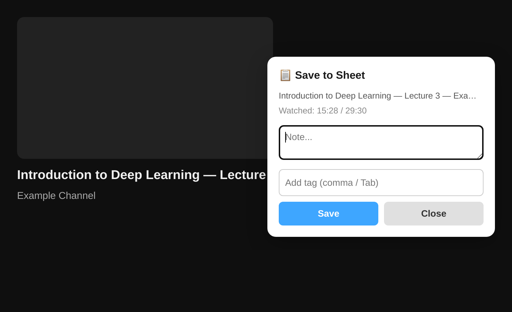
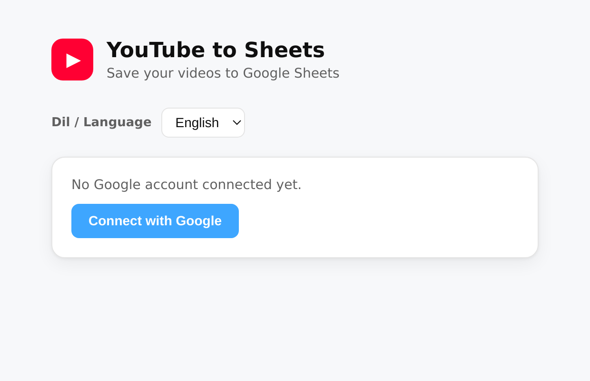

🇬🇧 **English** | 🇹🇷 [Türkçe](README.tr.md)

# YouTube to Sheets

A browser extension that saves the YouTube videos you watch — **with your notes and
tags** — to your own Google Sheet in one click. Manifest V3, no framework (vanilla JS).
Works on Chrome and Firefox.

Privacy-first: your data goes straight from your browser to Google — **no** third-party
servers, analytics, or ads. The extension only accesses Sheets it created (`drive.file`).

## Screenshots

## Features
- **Right-click → "Save to Sheet"** on any YouTube watch page, or use the
  **"Save this video?" prompt** that appears when a video opens (once per video)
- A small note card opens at the cursor (isolated in a closed Shadow DOM)
- Auto-filled info: title, channel, channel link, video URL, watched / total time
- Note + multiple **tags** (chips via comma / Tab / Enter)
- **One row per video (upsert):** saving the same video again updates its row —
  note appended, tags merged, watched time refreshed — instead of duplicating
- **Status** auto-derived from watch progress (Watched / Partially watched / Opened), editable in the card
- Create a sheet, pick one you created, or **open it** in a new tab from the options page
- **Light / dark / auto theme** (options page) + TR/EN language
- 10-column row: Date, Title, Channel, Channel Link, URL, Watched Time, Total Time, Note, Tags, Status

## Install (local / developer mode)

Build the packages: `./build.sh` →
- `dist/yt2sheets-chrome.zip` — Chrome
- `dist/yt2sheets-firefox.zip` — for AMO upload (Fx 140+ / Android 142+, all warnings clean)
- `dist/yt2sheets-firefox-dev.zip` — for local `about:debugging` install (Fx 115+)

### Chrome / Chromium
1. `chrome://extensions` → enable "Developer mode"
2. "Load unpacked" → select this folder
3. Connect your Google account from the options page, then create a sheet

### Firefox
1. `about:debugging` → "This Firefox" → "Load Temporary Add-on"
2. Select **`dist/yt2sheets-firefox-dev.zip`** (local install; works on older Firefox
   builds too). The plain `yt2sheets-firefox.zip` is for AMO — its
   `strict_min_version: 140` rejects temp installs on older Firefox.
3. Auth needs a separate Google **Web** OAuth client — see `docs/firefox-setup.md`

## For contributors: set up your own Google OAuth client
The client IDs in this repo belong to the project owner; to run your own copy you must
create your own clients (these are not secrets, but they won't work for you):

1. Create a project in the [Google Cloud Console](https://console.cloud.google.com/) and enable the **Google Sheets API**
2. Configure the OAuth consent screen (testing mode + add your Gmail as a test user), scopes: `drive.file`, `userinfo.email`
3. **Chrome:** OAuth client (type: Chrome Extension) → `manifest.json` `oauth2.client_id`
4. **Firefox:** OAuth client (type: Web application) → `auth.js` `FIREFOX_OAUTH.clientId` + redirect URI (`docs/firefox-setup.md`)

## Project structure
- `manifest.json` / `manifest.firefox.json` — Chrome / Firefox configuration
- `auth.js` — browser-agnostic OAuth layer
- `background.js` — service worker / event page: context menu, Sheets append
- `content.js` — YouTube DOM scrape + on-open prompt + note card (Shadow DOM) + status
- `options.html/css/js` — setup screen: connect, create/select/open sheet, language, theme
- `icons/` — logo (svg source + pngs)
- `build.sh` — builds the chrome/firefox zips
- `docs/` — Firefox setup, publishing, and store-listing guides
- `PRIVACY.md` — privacy policy

## Security & privacy
A security review was completed and all findings were resolved (formula injection, scope
reduction, Shadow DOM isolation, etc.). Details in `docs/` and `PRIVACY.md`.

## Contributing
Issues and PRs welcome. It's a small tool — readability and privacy come first.
See `CLAUDE.md` for code conventions (comments in Turkish, identifiers in English).

## License
[MIT](LICENSE) © 2026 Zafer Kahraman
