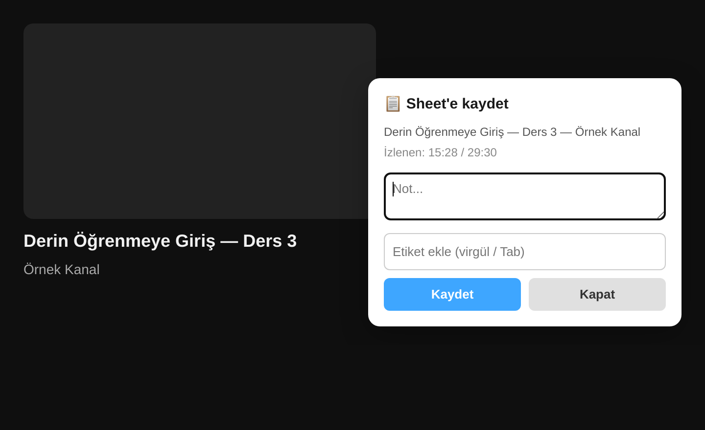
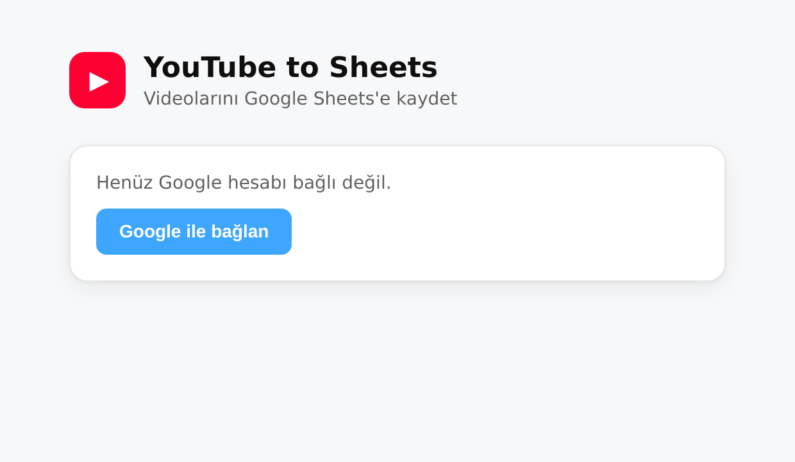

🇬🇧 [English](README.md) | 🇹🇷 **Türkçe**

# YouTube to Sheets

İzlediğin YouTube videolarını **not ve etiketlerle** tek tıkla kendi Google Sheets
dosyana kaydeden bir tarayıcı uzantısı. Manifest V3, framework yok (vanilla JS).
Chrome ve Firefox'ta çalışır.

Gizlilik öncelikli: verilerin doğrudan tarayıcından Google'a gider — üçüncü taraf sunucu,
analitik veya reklam **yok**. Uzantı yalnızca kendi oluşturduğu Sheets dosyalarına erişir
(`drive.file`).

## Ekran görüntüleri

## Özellikler
- YouTube watch sayfasında **sağ tık → "Sheet'e kaydet"**, ya da video açılınca
  çıkan **"Bu videoyu kaydedeyim mi?" balonu** (her video için bir kez)
- İmlecin olduğu yerde küçük not kartı (closed Shadow DOM ile izole)
- Otomatik bilgi: başlık, kanal, kanal linki, video URL'si, izlenen/toplam süre
- Not + çoklu **etiket** (virgül / Tab / Enter ile chip)
- **Video başına tek satır (upsert):** aynı videoyu tekrar kaydedince satır güncellenir —
  not altına eklenir, etiketler birleşir, izleme süresi tazelenir — yeni satır açılmaz
- İlerlemeye göre otomatik **Durum** (İzlendi / Kısmen izlendi / Açıldı), kartta düzenlenebilir
- Sheet oluştur, oluşturduklarından seç ya da ayarlar sayfasından **yeni sekmede aç**
- **Açık / koyu / otomatik tema** (ayarlar sayfası) + TR/EN dil
- 10 sütunlu satır: Tarih, Başlık, Kanal, Kanal Linki, URL, İzleme Süresi, Toplam Süre, Not, Etiketler, Durum

## Kurulum (lokal / geliştirici modu)

Paketleri üret: `./build.sh` →
- `dist/yt2sheets-chrome.zip` — Chrome
- `dist/yt2sheets-firefox.zip` — AMO yüklemesi için (Fx 140+ / Android 142+, tüm uyarılar temiz)
- `dist/yt2sheets-firefox-dev.zip` — lokal `about:debugging` yüklemesi için (Fx 115+)

### Chrome / Chromium
1. `chrome://extensions` → "Geliştirici modu" aç
2. "Load unpacked" → bu klasörü seç
3. Açılan ayarlar sayfasından Google ile bağlan, bir sheet oluştur

### Firefox
1. `about:debugging` → "This Firefox" → "Load Temporary Add-on"
2. **`dist/yt2sheets-firefox-dev.zip`** dosyasını seç (lokal yükleme; eski Firefox'larda
   da açılır). `yt2sheets-firefox.zip` AMO yüklemesi içindir — `strict_min_version: 140`
   olduğu için eski Firefox temp install'ı reddeder.
3. Auth için ayrı bir Google **Web** OAuth client gerekir — bkz. `docs/firefox-setup.md`

## Geliştiriciler için: kendi Google OAuth client'ını kur
Bu repo'daki client ID'ler proje sahibine aittir; kendi kopyanı çalıştırmak için kendi
client'larını oluşturman gerekir (gizli anahtar değildir ama sana çalışmaz):

1. [Google Cloud Console](https://console.cloud.google.com/)'da proje aç, **Google Sheets API**'yi enable et
2. OAuth consent screen (test mode + kendi Gmail'ini test user ekle), scope'lar: `drive.file`, `userinfo.email`
3. **Chrome:** OAuth client (type: Chrome Extension) → `manifest.json` `oauth2.client_id`
4. **Firefox:** OAuth client (type: Web application) → `auth.js` `FIREFOX_OAUTH.clientId` + redirect URI (`docs/firefox-setup.md`)

## Proje yapısı
- `manifest.json` / `manifest.firefox.json` — Chrome / Firefox yapılandırması
- `auth.js` — tarayıcı-bağımsız OAuth katmanı
- `background.js` — service worker / event page: context menu, Sheets append
- `content.js` — YouTube DOM scrape + açılış balonu + not kartı (Shadow DOM) + durum
- `options.html/css/js` — kurulum ekranı: bağlan, sheet oluştur/seç/aç, dil, tema
- `icons/` — logo (svg kaynağı + png'ler)
- `build.sh` — chrome/firefox zip üretimi
- `docs/` — Firefox kurulum, yayın ve mağaza-listesi rehberleri
- `PRIVACY.md` — gizlilik politikası

## Güvenlik & gizlilik
Güvenlik denetimi yapıldı; tüm bulgular kapatıldı (formül enjeksiyonu, scope daraltma,
Shadow DOM izolasyonu vb.). Detay: `docs/` ve `PRIVACY.md`.

## Katkı
Issue ve PR'lara açıktır. Küçük bir araç — okunabilirlik ve gizlilik önceliklidir.
Kod konvansiyonları için `CLAUDE.md`'ye bakın (yorumlar Türkçe, değişken adları İngilizce).

## Lisans
[MIT](LICENSE) © 2026 Zafer Kahraman
